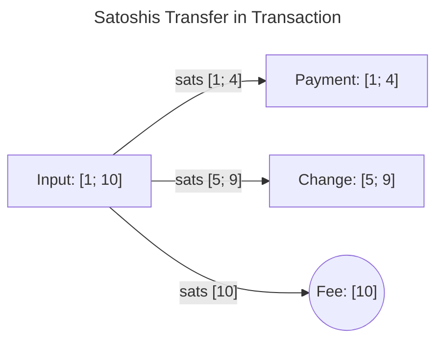
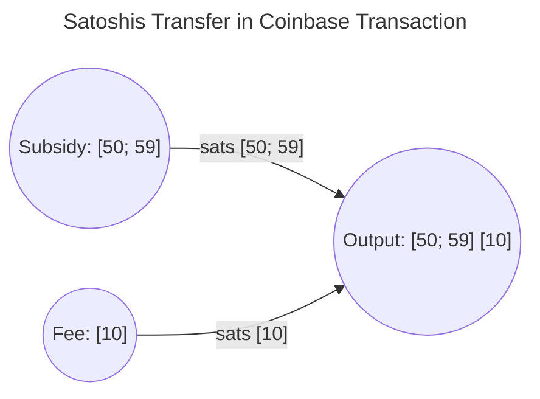

# **NFTs in Bitcoin?** From ordinals to inscriptions

Bitcoin, unlike many other cryptocurrencies (A.K.A. shitcoins), lacks a built-in way to link data to a specific identity, and this makes it tricky to create digital artifacts (NFTs - non-fungible tokens) that users can easily own, transfer, and sell. Bitcoin transactions primarily focus on displacing used tokens to create new unspent tokens, which makes it challenging to establish a clear connection between a digital asset and its owner.

These digital artifacts represent anything digitally recorded on a blockchain that someone can own. They are digital representations of real-world or digital items. Examples include digital artwork, vehicle titles, movie tickets, and certificates of authenticity.

Several proposals aim to add a way to differentiate tokens in Bitcoin, reducing its fungibility and allowing the creation and tracking of digital artifacts. One of the earliest attempts was [Colored Coins](https://bitcointalk.org/index.php?topic=347398.0); however, I find the [Ordinals Theory](https://docs.ordinals.com/introduction.html) particularly compelling due to its intuitiveness. This theory assigns a unique serial number to every single satoshi (the smallest unit of Bitcoin). This way, Ordinals allows us to track the movement of individual satoshis within those transactions.

## Ordinals

The Ordinals Theory is based on a few straightforward rules:

1. Each satoshi is assigned a number sequentially, starting from 0, according to the order in which it is mined.
2. When satoshis are transferred in a transaction, their ordinal numbers are assigned to the output satoshis on a first-in, first-out (FIFO) basis.
3. Coinbase transactions (the ones that create new Bitcoins) implicitly include a first input representing the newly mined Bitcoin. They also include an input for each fee-paying transaction in the block, ordered accordingly.
4. Underpaying transaction fees does not affect the ordinal numbers of satoshis mined in later blocks.

To illustrate with an example, imagine a transaction that spends one input token containing ten satoshis, numbered sequentially from 1 to 10. This transaction creates two output tokens: a payment token with 4 satoshis and a change token with 5 satoshis. Following the Ordinals Theory, the first four satoshis (numbered 1 through 4) are assigned to the payment token in order. The next 5 satoshis (numbered 5 through 9) are assigned to the change token, in order. The remaining satoshi (number 10) is effectively transferred as a fee to the miner who processed the transaction.



The miner of the same block can then create another transaction that combines the block subsidy and the transaction fee from our previous example into a single output. If we assume the block subsidy is 10 satoshis, starting with the ordinal number 50, the miner's output token would respectively contain satoshis numbered 50 through 59 (the subsidy) and satoshi number 10 (the fee from the previous transaction).



## Inscriptions

While the Ordinals Theory provides a stable way to identify individual satoshis within Bitcoin, it doesn't, by itself, allow us to associate data with those satoshis to create digital artifacts. Inscriptions fill this gap, providing a mechanism to attach data to a specific satoshi. Think of Ordinals as assigning a serial number to each satoshi, like numbering coins. Inscriptions are then like using tape to attach a piece of information to that numbered coin.


Behind the scenes, inscriptions store data within an unused part of a Bitcoin transaction's script. For those familiar with Bitcoin Script (its assembly language), the most common inscription method utilizes a Taproot script to "wrap" or "encapsulate" the data. The following example demonstrates a Taproot script within the first input of a transaction, inscribing the text "Hello, world!" onto the first satoshi of the transaction's output.

```sh
OP_FALSE
OP_IF
  OP_PUSH "ord" # indicate ordinals envolope
  OP_PUSH 1 # indicates that the next push is content-type
  OP_PUSH "text/plain;charset=utf-8"
  OP_PUSH 0 # indicates that subsequent pushes are content
  OP_PUSH "Hello, world!"
OP_ENDIF
```

Once a satoshi is associated with a digital artifact through inscription, the owner of that satoshi can then create transactions to sell the artifact, transfer it to another wallet, or even add further inscriptions to the same satoshi.

## Reference

[Ordinal Theory Handbook](https://docs.ordinals.com/introduction.html)
[BIP: Ordinal Numbers](https://github.com/ordinals/ord/blob/master/bip.mediawiki)
